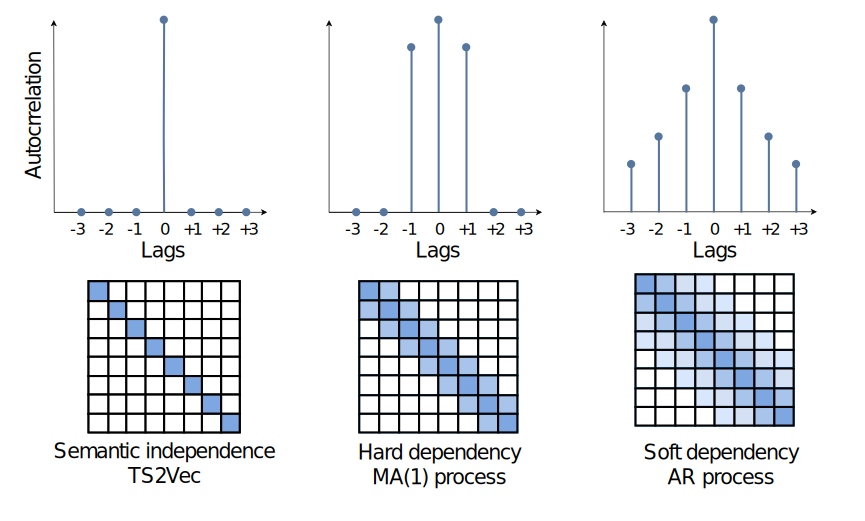

# DepTS2Vec

Official PyTorch implementation of the ICDM’25 paper:  
**A Theoretical Framework for Self-Supervised Contrastive Learning for Continuous Dependent Data**  
[[arXiv preprint]](https://arxiv.org/abs/2506.09785)

---

## Abstract

Self-supervised learning (SSL) has emerged as a powerful approach to learning representations, particularly in the field of computer vision. 
However, its application to dependent data, such as temporal and spatio-temporal domains, remains underexplored. 
Besides, traditional contrastive SSL methods often assume **semantic independence between samples**, which does not hold for dependent data exhibiting complex correlations. 

We propose a novel theoretical framework for contrastive SSL tailored to **continuous dependent data**, which allows the nearest samples to be semantically close to each other. In particular, we propose two possible **ground truth similarity measures** between objects &mdash; **hard** and **soft** closeness. Under it, we derive an analytical form for the *estimated similarity matrix* that accommodates both types of closeness between samples, thereby introducing dependency-aware loss functions.

We validate our approach, **Dependent TS2Vec**, on temporal and spatio-temporal downstream problems. 
Given the dependency patterns presented in the data, our approach surpasses modern ones for dependent data, highlighting the effectiveness of our theoretically grounded loss functions for SSL in capturing spatio-temporal dependencies.
Specifically, we outperform TS2Vec on the standard UEA and UCR benchmarks, with accuracy improvements of 4.17\% and 2.08\%, respectively. Furthermore, on the drought classification task, which involves complex spatio-temporal patterns, our method achieves a 7\% higher ROC-AUC score.

---

## Contents

This repository contains PyTorch implementations of our **dependency-aware loss functions** proposed in the paper.  
We release these losses to facilitate integration with existing SSL pipelines such as TS2Vec or other contrastive frameworks.  

<p align="center">
  
</p>

---

## Acknowledgements

The work was supported by the grant for research centers in the field of AI provided by the Ministry of Economic Development of the Russian Federation in accordance with the agreement 000000C313925P4F0002 and the agreement with Skoltech №139-10-2025-033.

---

## Citation

If you find this repository useful, please cite our work:

```bibtex
@article{marusov2025theoretical,
  title={A theoretical framework for self-supervised contrastive learning for continuous dependent data},
  author={Marusov, Alexander and Yugay, Aleksandr and Zaytsev, Alexey},
  journal={arXiv preprint arXiv:2506.09785},
  year={2025}
}
